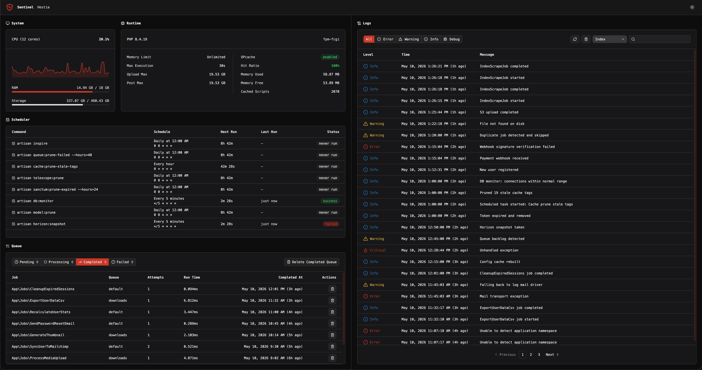

<br />
<div align="center">
    
</div>

<h1 align="center">Sentinel</h1>

<p align="center">
    A self-hosted Laravel dashboard for monitoring system resources, queues, scheduled tasks, and logs in real time. No external services required.<br />
    <br />
    <br />
    <a href="https://laravel.com">
        
    </a>
    <a href="https://www.php.net/">
        
    </a>
    <a href="https://svelte.dev/">
        
    </a>
</p>

---

## Preview



---

## Requirements

- **PHP** `^8.1`
- **Laravel** `10, 11, 12, or 13`

---

## Installation

1. **Add the VCS repository to `composer.json`**
   ```json
   "repositories": [
       {
           "type": "vcs",
           "url": "https://github.com/chrisquices/sentinel"
       }
   ]
   ```

2. **Require the package**
   ```bash
   composer require chrisquices/sentinel
   ```

3. **Publish config, views, and assets**
   ```bash
   php artisan vendor:publish --tag=sentinel --force
   ```

4. **Run the migrations**
   ```bash
   php artisan migrate
   ```

Once installed, visit `https://your-app.com/sentinel`. Change the `path` config value if you want a different URL.

---

## Configuration

After publishing, edit `config/sentinel.php`:

```php
return [
    // URL path where the dashboard is served
    'path' => 'sentinel',

    // Middleware applied to all Sentinel routes
    'middleware' => ['web'],

    // Display name shown in the dashboard header
    'project_name' => env('APP_NAME', 'My Project'),

    // Number of entries per page in the log viewer
    'pagination' => 20,

    // How often (seconds) the frontend polls the queue and log tail endpoints
    'poll_interval' => 3,
];
```

---

## Authentication

Sentinel uses a `viewSentinel` gate to control access. By default it allows access in the `local` environment only. To customise this, define the gate in your `AppServiceProvider`:

```php
use Illuminate\Support\Facades\Gate;

public function boot(): void
{
    Gate::define('viewSentinel', function ($user) {
        return in_array($user?->email, [
            'admin@example.com',
        ]);
    });
}
```

The gate callback receives the currently authenticated user, or `null` if the request is unauthenticated. Unauthenticated requests that fail the gate return `401`. Authenticated requests that fail return `403`.

To allow access without a user (e.g. IP-based):

```php
Gate::define('viewSentinel', function ($user) {
    return in_array(request()->ip(), ['127.0.0.1', '::1']);
});
```

---

## Features

### System
Live CPU usage with a rolling 60-sample history graph, memory usage and availability, and disk storage all read directly from the host OS.

### Runtime
PHP version, SAPI, memory limit, max execution time, upload limits, and OPcache status (enabled state, hit ratio, memory used/free, cached script count).

### Scheduler
Lists all commands registered in the Laravel console kernel. For each task:
- Cron expression with a human-readable description
- Live countdown to the next run (updates every second in the browser)
- Last ran time and exit status (success / failed / never run)

Run history is stored in the `sentinel_scheduler_runs` table and persists across deployments.

### Queue

Supports the **database** and **redis** queue drivers. If the app uses any other driver, the panel displays a clear unsupported message rather than empty tables.

Tabs: Pending, Processing, Completed, Failed each with a live job count that polls every `poll_interval` seconds. Clicking any row opens a detail dialog showing queue, connection, attempts, run time, completed/failed timestamps, full exception trace, and raw payload.

Actions:
- **Failed** retry a single job or bulk-delete all failed jobs
- **Completed** delete a single job or bulk-delete all completed jobs

Completed job tracking uses Sentinel's own `sentinel_completed_jobs` table.

### Logs

Reads all configured Laravel log channels that have an existing file (single and daily drivers, including stack channels). Features:

- **Level filter** All, Error, Warning, Info, Debug
- **Full-text search** searches across all entries for the active channel
- **Pagination** controlled by the `pagination` config value
- **Live tail** new entries are prepended automatically every `poll_interval` seconds when on page 1 with no active search
- **Detail dialog** click any row to see the full message and stack trace
- **Delete** wipe the active channel's log file, with a confirmation dialog

Active channel and level filter are persisted in `localStorage` across sessions.

---

## Rate Limiting

All mutation endpoints (retry, delete, bulk-delete, log wipe) are protected by a rate limiter named `sentinel-mutations`, capped at **10 requests per minute per IP**. Responses beyond the limit return JSON `429`.

---

## Local Development

After making changes to Sentinel, build the frontend assets and republish them in the consuming app:

```bash
# In the sentinel package
npm run build

# In the consuming app
composer update chrisquices/sentinel
php artisan vendor:publish --tag=sentinel --force
```

Published assets include a `filemtime`-based cache-busting query string automatically no manual versioning required.
